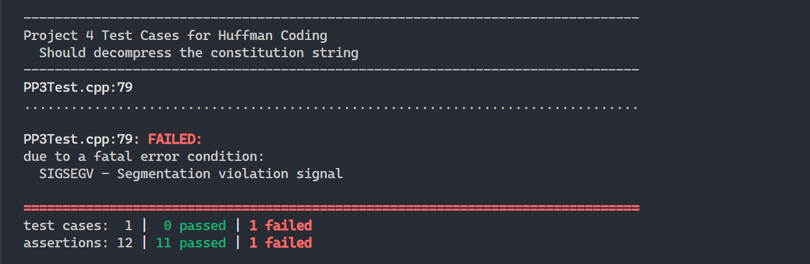

# Huffman Codes Generator

Huffman codes are a variable-length prefix coding technique used for lossless data compression, where shorter codes are assigned to more frequently occurring symbols in a message or file. This project implements the Huffman Codes algorithm including the compressions, serialization, and decompression steps for any input string.

## Usage

To use the code provided in this project simply clone the code from this github on your local machine. Make sure that you have C++ installed. 
> You can verify whether you have C++ installed by running the followig command in your terminal. 
```bash
g++ --version
```

### Compilation

```bash
g++ -std=c++17 -Wall *.cpp
```

This will generate an `a.out` executable (or a.exe if on windows). From there you can run the following command to run the test

## Testing

To be able to test the code in case you may want to make changes or imporvements to the algorithm, there are test located in `PP3Test.cpp` file. Afer you compile your code run the following command to run the test

```bash
./a.out -s
```

After you run that. you will see something similar to this in
your terminal


